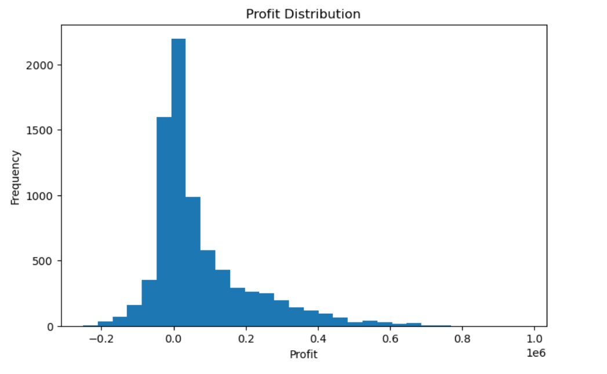
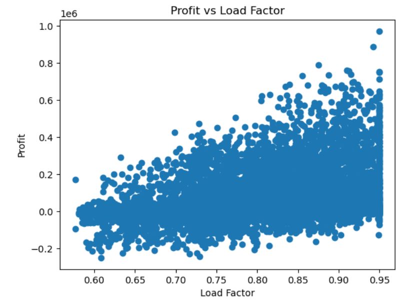
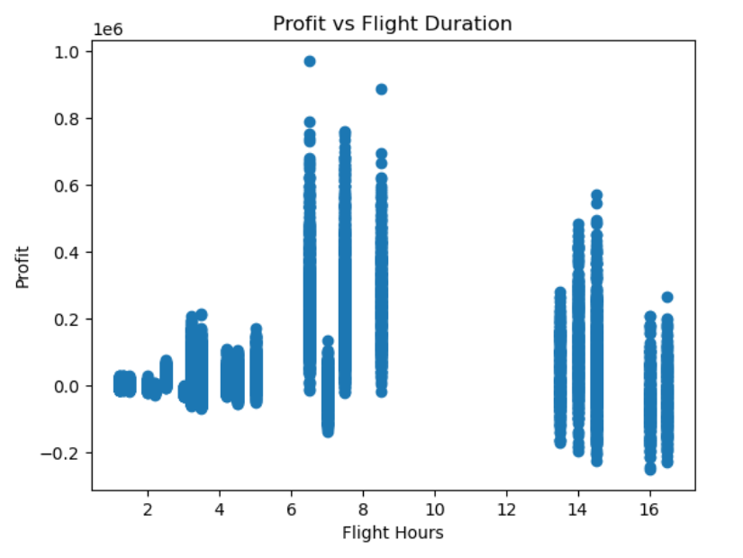
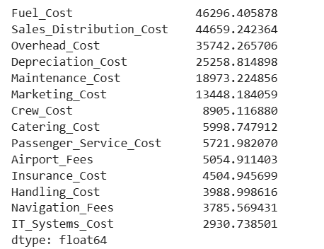
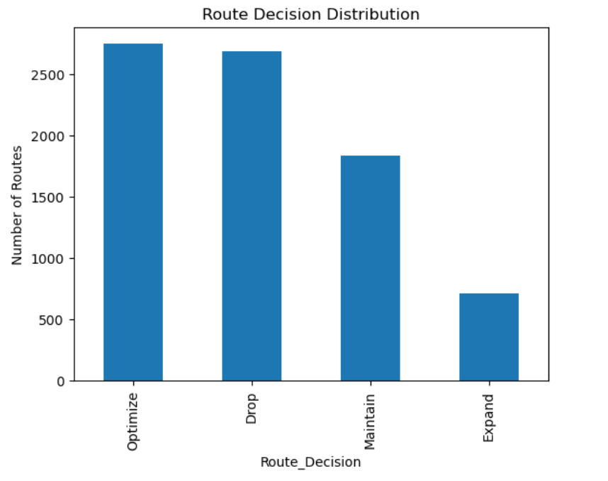
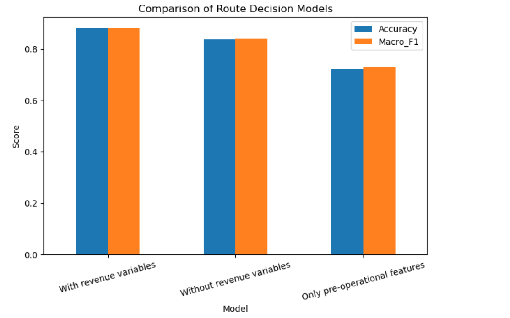
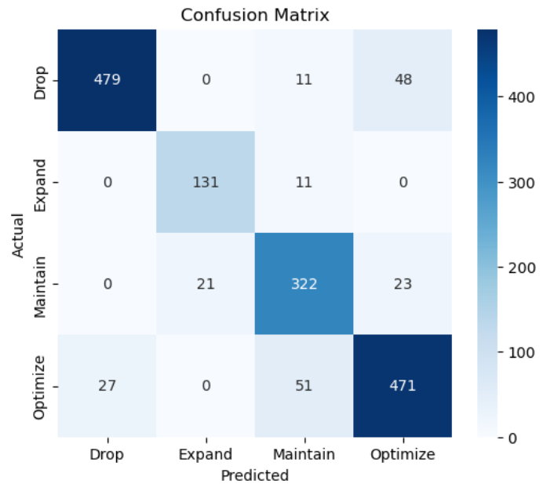
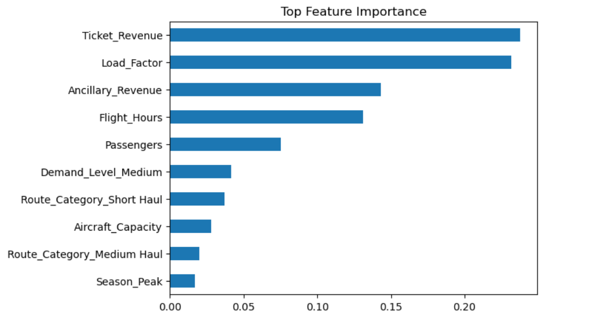

# Airline Route Profitability and Decision Intelligence System

## 1. Introduction

Airline route planning is a complex optimization problem involving demand forecasting, cost control, and profitability management. Airlines must continuously evaluate whether to expand, maintain, optimize, or discontinue routes based on financial and operational performance.

This project develops a data-driven system to analyze route-level performance and support strategic decision-making. By combining exploratory data analysis, rule-based classification, and machine learning models, the system provides both descriptive insights and predictive capabilities.

The objective is not only to understand current route performance but also to evaluate how early-stage operational features can be used to anticipate outcomes.

---

## 2. Dataset Description

The dataset contains 7,974 observations and 33 variables, representing airline route operations. Each row corresponds to a specific flight instance.

The dataset includes:

- Operational variables such as flight duration, aircraft capacity, and load factor  
- Demand-related features including passenger count, demand level, and seasonality  
- Revenue components such as ticket and ancillary revenue  
- Cost components including fuel, maintenance, crew, and overhead costs  
- Derived financial metrics such as total cost, profit, and profit margin  

Before analysis, the dataset was validated to ensure internal consistency. Profit values were verified against revenue and cost components, load factors were confirmed to lie within valid bounds, and no duplicate records were detected.

---

## 3. Exploratory Data Analysis

Exploratory analysis was conducted to understand the key drivers of profitability and identify patterns in route performance.

### 3.1 Profit Distribution

The distribution reveals a mix of profitable and loss-making routes, with a long right tail indicating that a small number of routes generate disproportionately high profits.

---

### 3.2 Profit vs Load Factor

A strong positive relationship is observed between load factor and profit. However, variability within similar load levels suggests that cost structure also plays a significant role.

---

### 3.3 Profit vs Flight Duration

Mid-range flights tend to achieve higher profitability, while very long routes often experience reduced margins due to increased operational costs.

---

### 3.4 Cost Structure

Fuel cost is the dominant expense category, followed by sales distribution and overhead costs. This highlights the importance of both operational efficiency and pricing strategy.

---

## 4. Rule-Based Decision Framework

A rule-based classification system was developed to categorize each route into one of four strategic decisions:

- Expand: High profit, high margin, high load factor  
- Maintain: Stable performance with consistent profitability  
- Optimize: Profitable but inefficient routes  
- Drop: Loss-making routes  

### Route Decision Distribution

The results show that a significant portion of routes require optimization, while a considerable number are loss-making. Only a small subset qualifies for expansion.

---

## 5. Machine Learning Models

To automate decision-making, three classification models were developed using different feature sets.

### 5.1 Model Definitions

1. **Model 1: Full Model (With Revenue Variables)**  
   Uses all financial and operational features  

2. **Model 2: Without Revenue Variables**  
   Excludes revenue-related features to simulate partial information scenarios  

3. **Model 3: Pre-Operational Model**  
   Uses only demand and operational features available before route performance is realized  

---

### 5.2 Model Performance Comparison

| Model | Accuracy | Macro F1 |
|------|---------|----------|
| With Revenue Variables | ~0.88 | ~0.88 |
| Without Revenue Variables | ~0.84 | ~0.84 |
| Pre-Operational Model | ~0.72 | ~0.73 |

The results show a clear decline in performance as financial information is removed. However, even the pre-operational model achieves reasonable predictive power, indicating that early-stage decisions can be informed using limited data.

---

### 5.3 Confusion Matrix (Best Model)

The full model demonstrates strong performance across all decision classes. It is particularly effective in identifying loss-making routes and optimization candidates, with relatively low misclassification rates.

---

### 5.4 Feature Importance

The most important features include:

- Ticket Revenue  
- Load Factor  
- Ancillary Revenue  
- Flight Hours  

In the absence of revenue variables, cost and operational features such as fuel cost and passenger count become more influential.

---

## 6. Key Insights

Several important insights emerge from the analysis:

- A large portion of routes are profitable but inefficient, indicating strong optimization opportunities  
- Many routes consistently generate losses and may need to be discontinued  
- High profitability is concentrated in a small subset of routes  
- Route performance is dynamic and varies over time  
- Operational features alone can provide meaningful predictive signals  

---

## 7. System Deployment

The analysis was deployed as an interactive dashboard using Streamlit. The dashboard allows users to:

- Explore route performance metrics  
- Visualize profitability patterns  
- View top-performing and underperforming routes  
- Analyze route stability and variability  
- Generate machine learning-based route decisions  

The system is designed for demonstration purposes and operates on a static dataset. It does not reflect real-time airline operations.

---

## 8. Limitations

- The dataset is simulated and may not fully capture real-world airline complexity  
- External factors such as competition, pricing dynamics, and weather are not included  
- Temporal dependencies are simplified  

---

## 9. Conclusion

This project demonstrates how data science techniques can be applied to solve real-world business problems in airline operations.

By integrating exploratory analysis, rule-based logic, and machine learning, the system provides a comprehensive framework for route-level decision-making.

A key takeaway is that while financial data significantly improves prediction accuracy, meaningful insights can still be derived from operational and demand features alone. This enables earlier and more proactive decision-making in real-world scenarios.

---

## Author

Chetan  
MSc Modeling, Data & Predictions  
University of Alberta
